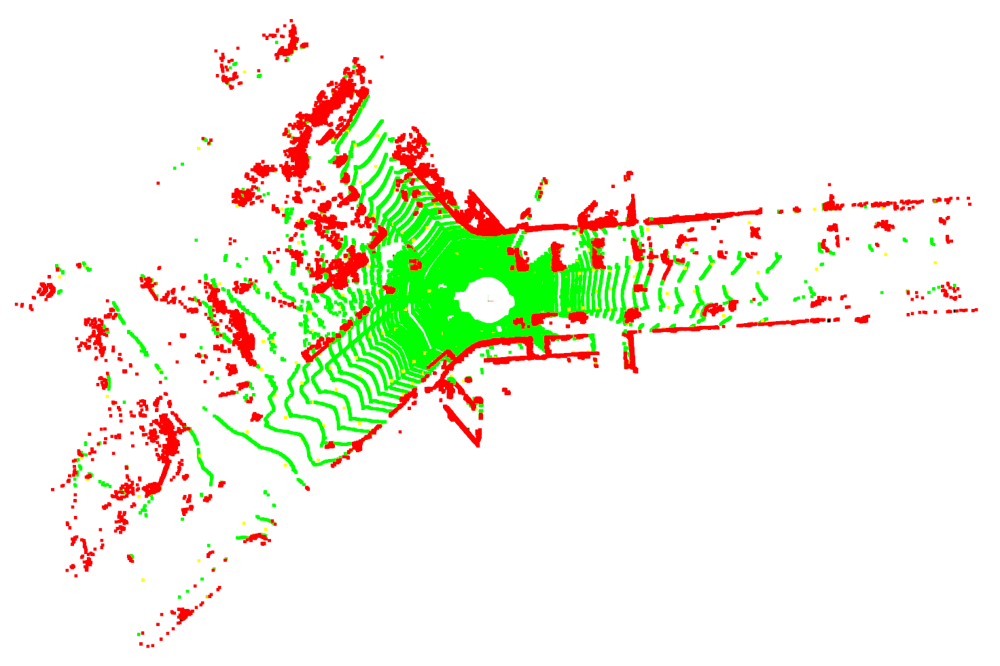

# Patchwork++

## :bookmark_tabs: About Patchwork++ (IROS'22)

* A fast and robust **ground segmentation algorithm** on 3D point cloud.

<p align="center"></p>

* An extension of [Patchwork][patchworklink] (RA-L'21 with IROS'21).
* Please refer our [paper][patchworkppIEEElink] for detailed explanantions and experimental results!

   * Validated on [SemanticKITTI][SemanticKITTIlink] dataset. The benchmark code is available on [here][benchmarklink].

* :bulb: Contents: [YouTube][YouTubeLink], [arXiv][arXivlink], [IEEE *Xplore*][patchworkppIEEElink]

[YouTubeLInk]: https://www.youtube.com/watch?v=fogCM159GRk
[arXivlink]: https://arxiv.org/abs/2207.11919
[patchworklink]: https://github.com/LimHyungTae/patchwork
[SemanticKITTIlink]: http://www.semantic-kitti.org/
[benchmarklink]: https://github.com/url-kaist/Ground-Segmentation-Benchmark

## :open_file_folder: What's in this repo

* C++ source code of Patchwork++ ([patchworkpp][sourcecodelink])
* Python binding of Patchwork++ using pybind11 ([python_wrapper][wraplink])
* Examples codes, which visualizes a ground segmentation result by Patchwork++ ([examples][examplelink]) :thumbsup:

> If you are familiar with ROS, you can also visit [here][roslink] and try executing ROS-based Patchwork++!

[roslink]: https://github.com/url-kaist/patchwork-plusplus-ros

[sourcecodelink]: https://github.com/url-kaist/patchwork-plusplus/tree/master/patchworkpp
[pybind11link]: https://github.com/pybind/pybind11
[wraplink]: https://github.com/url-kaist/patchwork-plusplus/tree/master/python_wrapper
[examplelink]: https://github.com/url-kaist/patchwork-plusplus/tree/master/examples

## :package: Prerequisite packages
> You may need to install Eigen, numpy, and Open3D. Open3D is used for point cloud visualization.

```bash
# To install Eigen and numpy
$ sudo apt-get install libeigen3-dev
$ pip install numpy

# To install Open3D Python packages
$ pip install open3d

# To install Open3D C++ packages
$ git clone https://github.com/isl-org/Open3D
$ cd Open3D
$ util/install_deps_ubuntu.sh # Only needed for Ubuntu
$ mkdir build && cd build
$ cmake ..
$ make
$ sudo make install
```

## :gear: How to build
> Please follow below codes to build Patchwork++.

```bash
$ git clone https://github.com/url-kaist/patchwork-plusplus
$ cd patchwork-plusplus
$ mkdir build && cd build
$ cmake ..
$ make
```

## :runner: To run the demo codes
> There are some example codes for your convenience!
> Please try using Patchwork++ to segment ground points in a 3D point cloud :smiley:

### Python
```bash
# Run patchwork++ and visualize ground points(green) and nonground points(red)
$ python examples/python/demo_visualize.py

# Run patchwork++ with sequential point cloud inputs 
$ python examples/python/demo_sequential.py
```

### C++
```bash
# Run patchwork++ and visualize ground points(green) and nonground points(red)
$ ./build/examples/cpp/demo_visualize

# Run patchwork++ with sequential point cloud inputs 
$ ./build/examples/cpp/demo_sequential

# Run patchwork++ with your point cloud file, example here
$ ./build/examples/cpp/demo_visualize ./data/000000.bin # specify file path
```

### Demo Result
If you execute Patchwork++ with given demo codes well, you can get the following result!

It is a ground segmentation result of data/000000.bin file using Open3D visualization. (Ground : Green, Nonground : Red)



## :pencil: Citation
If you use our codes, please cite our paper ([arXiv][arXivLink], [IEEE *Xplore*][patchworkppIEEElink])
```
@inproceedings{lee2022patchworkpp,
    title={{Patchwork++: Fast and robust ground segmentation solving partial under-segmentation using 3D point cloud}},
    author={Lee, Seungjae and Lim, Hyungtae and Myung, Hyun},
    booktitle={Proc. IEEE/RSJ Int. Conf. Intell. Robots Syst.},
    year={2022},
    pages={13276-13283}
}
```

In addition, you can also check the paper of our baseline, Patchwork. ([arXiv][patchworkarXivlink], [IEEE *Xplore*][patchworkIEEElink])
```
@article{lim2021patchwork,
    title={Patchwork: Concentric Zone-based Region-wise Ground Segmentation with Ground Likelihood Estimation Using a 3D LiDAR Sensor},
    author={Lim, Hyungtae and Minho, Oh and Myung, Hyun},
    journal={IEEE Robotics and Automation Letters},
    year={2021}
}
```
[patchworkppIEEElink]: https://ieeexplore.ieee.org/document/9981561
[patchworkarXivlink]: https://arxiv.org/abs/2108.05560
[patchworkIEEElink]: https://ieeexplore.ieee.org/document/9466396

## :triangular_flag_on_post: Tested Environment

- Ubuntu 18.04 and 20.04
- CMake 3.25.1 (>=3.20, min. Required to install Open3D)
- Open3D 0.15.2
- pybind11 v2.2.3
- Eigen 3.3.7


## :mailbox: Contact Information
If you have any questions, please do not hesitate to contact us
* [Seungjae Lee][sjlink] :envelope: `sj98lee at kaist.ac.kr`
* [Hyungtae Lim][htlink] :envelope: `shapelim at kaist.ac.kr`

[sjlink]: https://github.com/seungjae24
[htlink]: https://github.com/LimHyungTae
